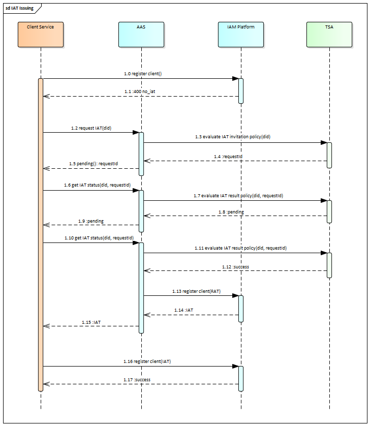

## Initial Access Token Issuing

The scenario happens between two GAIA-X domains (Client domain, SSI domain), when some application or service from Client domain wants to be registered in SSI domain and in it internal IAM Platform. To be protected with AAS and IAM, client applications must be registered in the IAM. Client can be registered in IAM using Dynamic Client Registration (DCR) protocol, but at the call to DCR endpoint Client must be authenticated. Client can be authenticated to IAM with help of Initial Access Token (IAT) provided as Bearer value in Authorization header. So, the IAT Issuing interface provides an ability for external Clients to obtain IAT to be used for authentication in subsequent DCR scenario.

The IAT Provider API is:

The communication flow between Client app, AAS and its IAM is:

As alternative, the DCR scenario can be covered completely by our AAS implementation removing a necessity for Client to do extra calls for IAT and performing the whole scenario in synchronous way. Communication flow participans are:

- Client Service – an application or service in Client domain
- Client OCM – Organization Credential Manager (LOT3) in Client domain
- SSI Broker (SSI IAT Provider) – an endpoint from AAS in SSI domain
- SSI TSA – Trast Service API (LOT4) from SSI domain
- SSI OCM – LOT3 from SSI domain
- SSI IAM – Identity and Access Management Platform from SSI domain

An alternative DCR communication flow is:

1.	OCM services from different domains establish trust connection between each other (some flow in Notarization or Orchestration LOTs, probably)
2.	Client Service registers with OCM in its local domain
3.	Client Service performs a dynamic registration via standard DCR endpoint in SSI AAS

