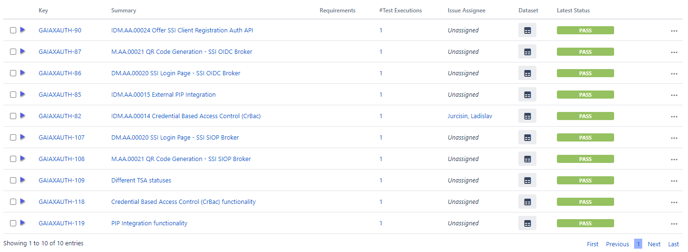

## Conformance & Verification

See [AAS Test Plan](./Test_Plan.pdf) for all details regarding projects testing activities.

Some project functions were tested with [OpenID Conformance Suite](https://openid.net/certification/about-conformance-suite/), below you can find the official test suite results:

- [OpenID Connect Discovery](./config) endpoint: `/.well-known/openid-configuration`
- [OpenID Connect Core](./auth) endpoints: `/oauth2/authorize`, `/oauth2/jwks`, `/oauth2/token`, `/userinfo`

A number of pen-tests were applied to the service, see [Penetration test results](./pentest) 

JMetter [Load tests and results](./load) are also provided.

 

**The following requirements were tested manually, Jira Xray used as a Test repository:**
 

| Test case name                                       | Description                                    | 
|------------------------------------------------------|:-----------------------------------------------|
| Different TSA statuses                               |Check different statuses - GetLoginProofResult: REJECTED, GetIatProofResult: REJECTED, GetLoginProofResult: TIMED_OUT, GetIatProofResult: TIMED_OUT, GetLoginProofResult: ACCEPTED, GetIatProofResult: ACCEPTED | 
| IDM.AA.00026 Standard IAM Compatibility              | The issued Initial Access Token MUST be compatible with the Client Registration Endpoint of the docked standard IAM. It MUST be possible to register with this IAT client.| 
| IDM.AA.00025 Policy based authorization              |The SSI IAT Provider MUST integrate with Trust Services to conduct policy authorization checks of the client trying to obtain an Initial Access Token (IAT). IAT MUST not be issued unless the policy evaluation allows for that operation.|
| IDM.AA.00024 Offer SSI Client Registration Auth API  |An API as per SSI Client Registration Auth API API MUST be offered to enable initiation and polling for the result of SSI-based issuance of IAT for Dynamic Client Registration.| 
| M.AA.00021 QR Code Generation - SSI OIDC Broker      |The QR code contains the content of the SSI invitations/proofs, which MUST be obtained from an external URL with the values for scope and a value for “Namespace”. Scope Values MUST be extracted from the authorize request. The link content has to be generated in a QR Code. PresentationID needs be securely stored in the browser session, so that it’s available for the [IDM.AA.00028] Login State Background Polling process and not revealed outside of this context as it represents a secure token to get identity data.|
| DM.AA.00020 SSI Login Page - SSI OIDC Broker         |The OIDC Provider MUST contain a customizable Standard Login web page integrated into OIDC Authorization flow and endpoint as per [OIDC.Core] which shows an QR Code for login using another device hosting Personal Credential Manager as well as a button with the same link being able to openPersonal Credential Manager on the same device.| 
| IDM.AA.00015 External PIP Integration                |It MUST be demonstrated how an external PIP with asynchronous behavior can be integrated in the authorization services of a standard IAM system. It MAY be demonstrated with additional components.|
| IDM.AA.00014 Credential Based Access Control (CrBac) |The SSI adoption SHOULD be able to dynamically reload credentials for access decisions, for instance the current identity wants a “sales” action and is currently just logged in with a “visitor” permission. The CrBac SHOULD be able to resolve this by requesting new credentials.This might be achieved either by a renewed authentication and authorization flow triggered by the application (via SSI OIDC Provider), or via an asynchronous process, which SHOULD be done over standard IAM outgoing PIP interface towards Trust Services or the It MAY be realized over additional components within the architecture, but the Standard IAM MUST NOT be modified (excepting configuration, plugins or supported extensions).| 

**Manual test execution results:**
